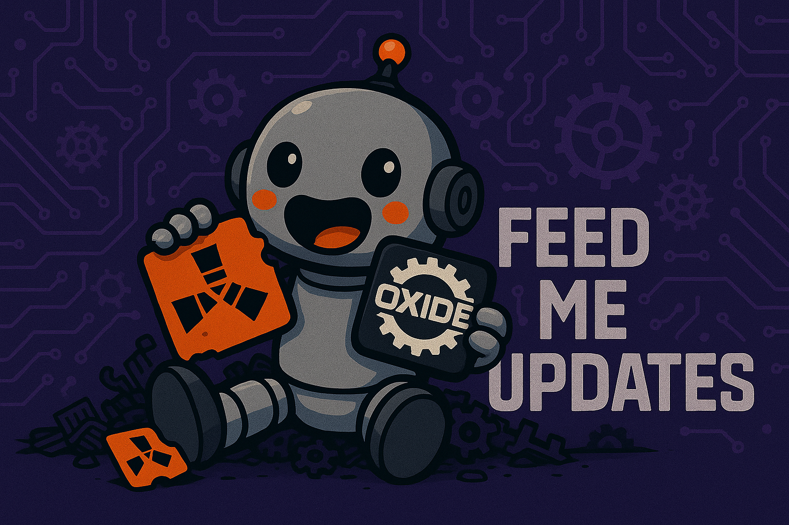

# FeedMeUpdates

> Automatic, configurable update orchestrator for Rust + Oxide servers: detects server / Oxide / plugin changes, performs safe backup, applies updates, restarts cleanly, and notifies Discord.



<!-- Optional badges (uncomment once available) -->
<!-- [](https://github.com/frankie290651/FeedMeUpdates/actions/workflows/ci.yml) -->
[](https://github.com/frankie290651/FeedMeUpdates/releases)
[](LICENSE)
[](https://github.com/frankie290651/FeedMeUpdates/issues)

## Table of Contents
1. Overview  
2. Features  
3. Architecture  
4. Requirements  
5. Quick Start  
6. Installation  
7. Configuration  
   - Example JSON  
   - Parameter Reference  
8. Update Flow  
9. Advanced: Scheme Rules  
10. Service Integration  
11. Discord Notifications  
12. Error Handling & Debugging  
13. Security & Permissions  
14. FAQ  
15. Contributing  
16. License  
17. Keywords / Discoverability  

---

## 1. Overview
FeedMeUpdates consists of:
- Oxide plugin (`FeedMeUpdates.cs`) coordinating detection, countdown, and server restart logic.
- Companion executable (`FeedMeUpdates.exe` / `FeedMeUpdates` on Linux) performing backup, update tasks (Rust / Oxide / plugins), and writing result markers.

It minimizes downtime while providing flexible rules and safe rollback behavior.

## 2. Features
- Automatic Rust server update (SteamCMD)
- Automatic Oxide update
- Optional uMod plugin updates
- Backup & restore on failure
- Discord webhook notifications (start + result)
- In-game countdown (chat messages)
- Cross-platform support (Windows / Linux)
- Works with script-based or service-based startup
- Custom rule engine ("Scheme") for conditional update decisions
- Granular polling intervals and attempt limits

## 3. Architecture (High-Level)
```
[Oxide Plugin]
  ├─ Detects changes (server / Oxide / plugins)
  ├─ Schedules update (countdown)
  ├─ Invokes updater executable
  └─ Reads markers & sends Discord notifications

[Updater Executable]
  ├─ Creates backup
  ├─ Applies Rust + Oxide updates
  ├─ Optionally updates plugins
  ├─ Writes marker & exit code
  └─ Restarts server (script or service)
```

## 4. Requirements
- Rust Dedicated server directory with permissions to spawn processes
- Oxide installed
- SteamCMD accessible and functional
- .NET 8 Runtime (only for non-standalone build)
- Enough free disk space to store a full backup of the server folder

## 5. Quick Start
```bash
# 1. Stop server
# 2. Backup server folder
# 3. Copy FeedMeUpdates.cs → oxide/plugins
# 4. Copy FeedMeUpdates.json → oxide/config
# 5. Copy FeedMeUpdates(.exe) → server root
# 6. Edit FeedMeUpdates.json (paths + options)
# 7. Start server (first run will shut down, update, restart)
```

## 6. Installation (Detailed)
1. Stop the server gracefully.
2. Create a manual backup (delete later if installation succeeds).
3. Place the plugin and executable.
4. Configure the JSON file with proper absolute paths.
5. Ensure script or service integration matches section 10.
6. Start the server; the plugin triggers an immediate update cycle on first run.

## 7. Configuration

### 7.1 Example `FeedMeUpdates.json`
```json
{
  "ServerDirectory": "/home/rust/rust-server",
  "SteamCmdPath": "/usr/games/steamcmd",
  "UpdaterExecutablePath": "/home/rust/rust-server/FeedMeUpdates",
  "ShowUpdaterConsole": false,
  "ServerStartScript": "/home/rust/rust-server/start_server.sh",
  "RunServerScriptHidden": true,
  "ServerTmuxSession": "",
  "RustOnService": false,
  "ServiceName": "",
  "StartupScan": true,
  "MaxAttempts": 0,
  "CheckIntervalMinutes": 10,
  "CountdownMinutes": 5,
  "UpdatePlugins": false,
  "OnlyServerProtocolUpdate": false,
  "UseScheme": false,
  "SchemeFile": "",
  "DailyRestartTime": "",
  "MinutesBeforeRestart": 60,
  "DiscordNotificationsEnabled": false,
  "DiscordWebhookUrl": "",
  "UpdaterMarkerFileName": "updateresult.json",
  "UpdaterLockFileName": "updating.lock",
  "MarkersSubfolder": "markers"
}
```

### 7.2 Parameter Reference
| Key | Default | Description | Notes |
|-----|---------|-------------|-------|
| ServerDirectory | required | Root path where `RustDedicated` resides | Must exist |
| SteamCmdPath | required | Full path to `steamcmd` | Needed for server updates |
| UpdaterExecutablePath | required | Full path to updater executable | Invoked by plugin |
| ShowUpdaterConsole | false | Try visible console window | Ignored if `RustOnService=true` |
| ServerStartScript | (none) | Startup script path | Unused if using service |
| RunServerScriptHidden | true | Hide startup script console | Linux may attempt GNOME terminal / tmux |
| ServerTmuxSession | "" | tmux session name (Linux) | Only when visible launch |
| RustOnService | false | Set true if server runs as a service | Requires exit code config |
| ServiceName | "" | Service identifier | Required when `RustOnService=true` |
| StartupScan | true | Immediate update check at plugin init | If false, only periodic checks |
| MaxAttempts | 0 | Limit before disabling plugin | 0 = unlimited |
| CheckIntervalMinutes | 10 | Poll frequency | Balance load vs freshness |
| CountdownMinutes | 5 | In-game warning period | Chat messages |
| UpdatePlugins | false | Enable plugin updates | uMod-listed only |
| OnlyServerProtocolUpdate | false | Update only on major protocol change | Requires Oxide + server change |
| UseScheme | false | Enable custom rule logic | Needs valid scheme file |
| SchemeFile | "" | Path to scheme file | See section 9 |
| DailyRestartTime | "" | HH:mm daily restart schedule | Empty disables feature |
| MinutesBeforeRestart | 60 | Suspend checks before daily restart | Avoid race with planned restart |
| DiscordNotificationsEnabled | false | Send start + result messages | Uses webhook |
| DiscordWebhookUrl | "" | Webhook URL | Store securely if private |
| UpdaterMarkerFileName | updateresult.json | Result marker file | Written by updater |
| UpdaterLockFileName | updating.lock | Lock file for concurrency | Prevents overlapping runs |
| MarkersSubfolder | markers | Folder for markers | Relative to server directory |

## 8. Update Flow
1. Detect update conditions (Rust / Oxide / plugins).
2. Issue countdown warnings in chat.
3. Stop server process.
4. Create backup.
5. Apply Rust update (SteamCMD).
6. Apply Oxide update.
7. Update plugins (optional).
8. Write marker file + exit code.
9. Restart server (script or service).
10. Send Discord notification.

## 9. Advanced: Scheme Rules
Format per line:
```
events=action
```
Events combined with `+`:
- `server` → server changed
- `oxide(...)` → oxide changed with protocol flags:
  - `s` same protocol
  - `c` changed protocol
  - `u` unknown protocol
  - `e` error while fetching protocol
- `oxide` (no parentheses) → any of e,s,c,u

Actions: `server | oxide | both`

Examples:
```
oxide(eucs)+server=both
oxide(su)=oxide
server=server
```
Processing is top-down; first match wins. Invalid lines disable `UseScheme` and revert to default logic.

## 10. Service Integration

### Windows (NSSM)
Recommended commands:
```powershell
# Set restart behavior
nssm set <service_name> AppExit Default Restart
nssm set <service_name> AppExit 0 Exit
nssm set <service_name> AppExit 4294967295 Exit
nssm set <service_name> AppExit 3221225786 Exit

# Configure stop method
nssm set <service_name> AppStopMethodSkip 6
nssm set <service_name> AppStopMethodConsole 60000

# Disable Windows failure recovery
sc.exe failureflag <service_name> 0
reg delete "HKLM\SYSTEM\CurrentControlSet\Services\<service_name>" /v FailureActions /f
```

Verify service control:
```powershell
sc stop <service_name>
sc start <service_name>
```

If service control fails, move NSSM to a stable path (e.g., `C:\Tools\nssm\nssm.exe`) and update the service binPath.

### Linux (systemd)
Add these directives to your service unit file:
```ini
[Service]
KillMode=process
KillSignal=SIGINT
SendSIGKILL=no
Restart=on-failure
SuccessExitStatus=0 9 SIGKILL
NoNewPrivileges=false
```

Grant passwordless sudo for service start:
```bash
# Replace USERNAME and SERVICE with your values
USERNAME="user"
SERVICE="rust-server.service"
SYSTEMCTL_PATH="$(command -v systemctl)"

# Add sudoers rule for start command only
echo "${USERNAME} ALL=(root) NOPASSWD: ${SYSTEMCTL_PATH} start ${SERVICE}" | sudo tee /etc/sudoers.d/${SERVICE%.service}-start >/dev/null
sudo chown root:root /etc/sudoers.d/${SERVICE%.service}-start
sudo chmod 0440 /etc/sudoers.d/${SERVICE%.service}-start
sudo visudo -c -f /etc/sudoers.d/${SERVICE%.service}-start

# Ensure NoNewPrivileges is false
sudo mkdir -p /etc/systemd/system/${SERVICE}.d
printf "[Service]\nNoNewPrivileges=false\n" | sudo tee /etc/systemd/system/${SERVICE}.d/override.conf >/dev/null
sudo systemctl daemon-reload
```

## 11. Discord Notifications
Set `DiscordNotificationsEnabled` to `true` and provide a valid webhook URL in `DiscordWebhookUrl`. The plugin sends:
- **Start notification**: When update begins (includes countdown time).
- **Result notification**: After update completes (success or failure details).

Example webhook URL: `https://discord.com/api/webhooks/123456789/abcdef...`

## 12. Error Handling & Debugging
The updater writes logs and markers for troubleshooting:
- **`updater.log`**: Located in server root, contains detailed execution logs.
- **`updateresult.json`**: Marker file created after each update attempt, moved to `markers/` subfolder upon server restart.

Marker file fields:
- `result`: `"success"` or `"failure"`
- `fail_reason`: Error description (if applicable)
- `update_id`: `"init"` (first run), `"testrun"` (manual test), or random 8-digit string

Check markers folder to review past update attempts.

## 13. Security & Permissions
- **File permissions**: Ensure the updater executable has execute permissions (`chmod +x` on Linux).
- **Service permissions**: Grant only necessary permissions (e.g., passwordless `systemctl start` for the specific service, not all systemctl commands).
- **Discord webhook**: Treat webhook URLs as secrets; restrict access to config files.
- **SteamCMD**: Ensure SteamCMD directory is owned by the server user.
- **Backup storage**: Verify sufficient disk space for backups before enabling updates.

## 14. FAQ

**Q: Can I run updates without shutting down the server?**  
A: No, updates require server shutdown to replace files safely.

**Q: What happens if an update fails?**  
A: The updater restores the backup automatically and writes failure details to the marker file.

**Q: Can I skip plugin updates?**  
A: Yes, set `UpdatePlugins` to `false`.

**Q: How do I test the updater without affecting my live server?**  
A: Use the `feedme.testrun` command in-game (admin only).

**Q: Does FeedMeUpdates work with modded versions of Oxide?**  
A: It works with standard Oxide distributions. Custom Oxide builds may require adjustments.

**Q: Can I use this on a containerized server?**  
A: Yes, but ensure the container has access to SteamCMD and proper file permissions.

## 15. Contributing
Contributions are welcome! Please follow this workflow:
1. Open an issue describing the bug or feature request.
2. Fork the repository and create a feature branch.
3. Submit a pull request with a clear description of changes.

Keep contributions focused and minimal. Test changes thoroughly before submission.

## 16. License
This project is licensed under the MIT License. See the [LICENSE](LICENSE) file for details.

## 17. Keywords / Discoverability
`rust-server` `rust-dedicated` `oxide` `umod` `automatic-updates` `steamcmd` `server-management` `discord-notifications` `backup-restore` `cross-platform` `windows` `linux` `systemd` `nssm` `game-server` `server-automation` `rust-updates` `oxide-updates` `plugin-manager` `server-updater`
